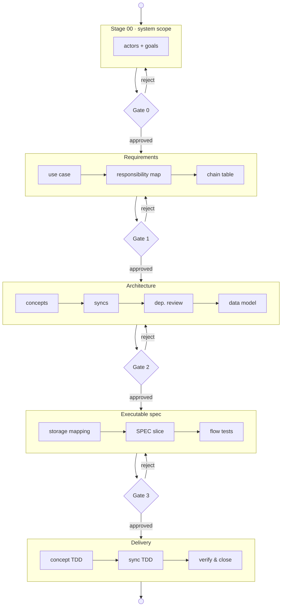

# CLAD — Contract-Led, Artefact-Driven Development

> A starter repository for building software with AI coding agents under a
> discipline that keeps every decision **legible, reviewable, and reversible**.

**TL;DR:** CLAD is a staged, contract-driven workflow that lets one human
reviewer steer a fast AI coding agent — stage by stage, artefact by
artefact — without losing control of the system being built.

## How CLAD works

CLAD is a state machine of stages punctuated by human review gates. The
human provides a brief and reviews artefacts at each gate; the agent reads
a stage contract, produces only the declared outputs, and stops. A
rejection sends work back to the earliest stage that owns the defect:



One collaborative scoping gate for the system, then three review gates per
use case (Requirements → Architecture → Executable spec). Stage 00 runs
once per brief; stages 01–05 run once per in-scope goal. The full stage
table is in [`AGENTS.md`](AGENTS.md) §3; the artefact dependency graph is
in [`methodology/architecture/ARTEFACT_MAP.md`](methodology/architecture/ARTEFACT_MAP.md).

### Enforcement without a harness

CLAD embeds the same deterministic Python gate (`verify_artefacts.py`) into
three points on the agent's critical path. Each layer blocks a different
escape route — the agent can't do useful work without passing the one it's
currently blocked by:

| Layer | When it fires | What it blocks | Why the agent can't skip it |
|---|---|---|---|
| **1. Self-audit** | End of every stage | Advancing or presenting for review | Required by AGENTS.md principle 14 before `advance.py` |
| **2. Test loop** | Every `test.command` | Test feedback | The agent must run tests to iterate; the gate is wired into `clad.properties` as `python3 quality-gate/verify_artefacts.py && mvn test` |
| **3. Commit hook** | Every `git commit` | The commit itself | Installed via `core.hooksPath`; `--no-verify` is banned by rule R18 |

The key insight: **CLAD controls feedback, not the agent.** An agent that
skips a stage doesn't get test results. An agent that never runs tests
can't write working code. An agent that can't commit can't deliver.

## What CLAD guarantees

1. **Requirements → code.** Every in-scope goal becomes a use-case
   scenario → chain table → concept specs + sync contracts → SPECs +
   TDD tests → implementation. Nothing appears in code without a
   requirement upstream.

2. **Code → requirements.** Every runtime action emits a flow token.
   Stage 05 walks the token tree and proves the running system produced
   exactly the sequence the chain table predicted. Unauthorised actions
   are findings.

3. **Locally reviewable.** No concept imports another. Cross-concept
   coordination lives only in declarative syncs — `when X completes then
   Y`. A change's blast radius is visible in one sync file.

4. **Mechanically enforced.** The artefact gate blocks test feedback when
   a stage is skipped, a gate is unapproved, or implementation drifts from
   its spec. No harness, no framework-specific hooks — plain `python3`
   checks.

## Quick start

```bash
git clone https://github.com/abratto/clad.git
cd clad
```

**One-time setup.** Activate the pre-commit hook so `git commit` refuses
commits that skip a stage or decouple code from its spec:

```bash
./quality-gate/install-hooks.sh
```

A blocked commit is a real defect — fix it, do not bypass it.

**Two prompts to start.** After cloning, open a chat with any AI coding
agent (Copilot, Claude, Cursor, OpenCode, …) in this workspace:

1. Send: `Read AGENTS.md in full and follow it, then wait for my brief.`
2. Send: `I want to build <one paragraph describing what the system should let users do>. Run system-scope Stage 00.`

The agent runs Stage 00 at system scope — proposes actors and goals, asks
clarifying questions, and writes nothing until you approve. After that,
the agent creates one `features/UC-XX-<slug>/` folder per in-scope goal and
walks each through stages 01–05, pausing only at the three human gates.
Steer in plain language: "what's next", "let's do UC-02", "redo the syncs".

**Reading order** (if you want the full picture):
[`AGENTS.md`](AGENTS.md) → [`methodology/README.md`](methodology/README.md) →
[`methodology/WALKTHROUGH.md`](methodology/WALKTHROUGH.md) →
[`features/UC-00-login/README.md`](features/UC-00-login/README.md)

### Requirements

| What you want to do | What you need |
|---|---|
| Use CLAD as a methodology starter | Git, an editor, an AI coding agent |
| Run the quality-gate scripts | Python 3 |
| Run the Java reference profile | Java 21 + Maven |

### Configuration

Edit [`clad.properties`](clad.properties) at the repo root to set
project-wide defaults:

```properties
# The canonical test command — runs the artefact gate before tests.
test.command=python3 quality-gate/verify_artefacts.py && mvn test

# Describe your persistence technology.
storage.layer=Jena TDB2 named graph (Java/Micronaut profile)

# How advance.py handles human gates (gated | auto | yolo).
workflow.autonomy=gated
```

## Status

CLAD is **public, pre-1.0, and still evolving.** It ships a complete
methodology loop, agent guides, a worked example
([`features/UC-00-login/`](features/UC-00-login/README.md)), and an
optional Java reference profile under
[`reference-impl/java-micronaut-jena/`](reference-impl/java-micronaut-jena/).
The methodology is profile-agnostic; the Java profile is the only runnable
implementation today. Pre-1.0 releases may include breaking methodology
changes.

CLAD works with any agent framework. Agents that support
[agentskills.io](https://agentskills.io) auto-discover CLAD skills from
the `skills/` directory. No platform-specific configuration is required.

## Repository layout

```
clad/
├── README.md
├── AGENTS.md                        Canonical agent guide (single source)
├── CLAUDE.md                        Adapter -> AGENTS.md
├── .github/copilot-instructions.md  Adapter -> AGENTS.md
├── .cursor/rules/clad.mdc           Adapter -> AGENTS.md
├── clad.properties                  Project-wide settings
├── CONTEXT.md                       Workspace routing
├── skills/                          Portable agent skills (agentskills.io)
├── quality-gate/                    Deterministic Python checks
│
├── methodology/
│   ├── core/                        CLAD: contracts, artefacts, principles
│   ├── architecture/                Legible/WYSIWID + ARTEFACT_MAP.md
│   ├── implementation/              Hard rules, stages, quality gate
│   ├── overlays/                    Optional: tracking, planning, decisions
│   └── reference/                   Citations and sources
│
├── templates/                       Per-artefact templates
│   ├── feature-skeleton/            Copy this to start a new feature
│   ├── plan-board.md                Optional sequencing board
│   └── ...
│
├── features/
│   ├── _system/                     System-level Stage 00 (run once per brief)
│   └── UC-00-login/                 Worked example (stages 00–05)
│
└── reference-impl/
    └── java-micronaut-jena/         Optional Java reference profile
```

## License

Apache License 2.0. See [LICENSE](LICENSE) and [NOTICE](NOTICE).

## Citations

- Meng, E. & Jackson, D. (2025). *What You See Is What It Does: A Structural
  Pattern for Legible Software.* Onward! 2025.
  [DOI 10.1145/3759429.3762628](https://doi.org/10.1145/3759429.3762628) ·
  [arXiv 2508.14511](https://arxiv.org/abs/2508.14511)
- Van Clief, J. (2026). *Interpretable Context Methodology (ICM).*
  [arXiv 2603.16021](https://arxiv.org/abs/2603.16021) ·
  [github.com/RinDig/Interpretable-Context-Methodology-ICM-](https://github.com/RinDig/Interpretable-Context-Methodology-ICM-)
