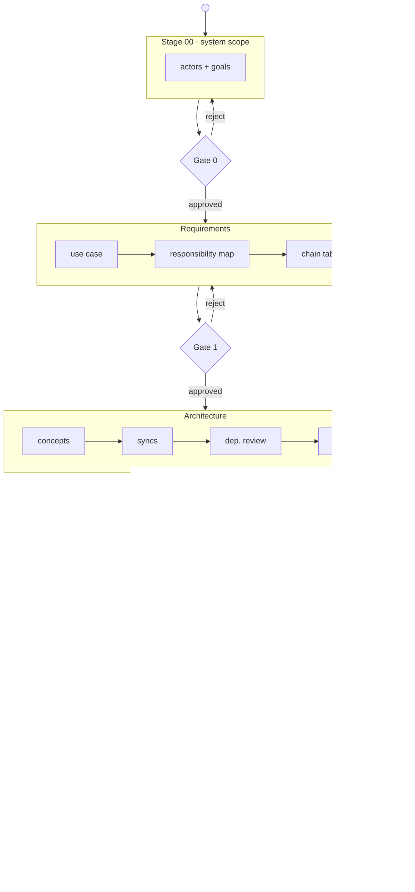
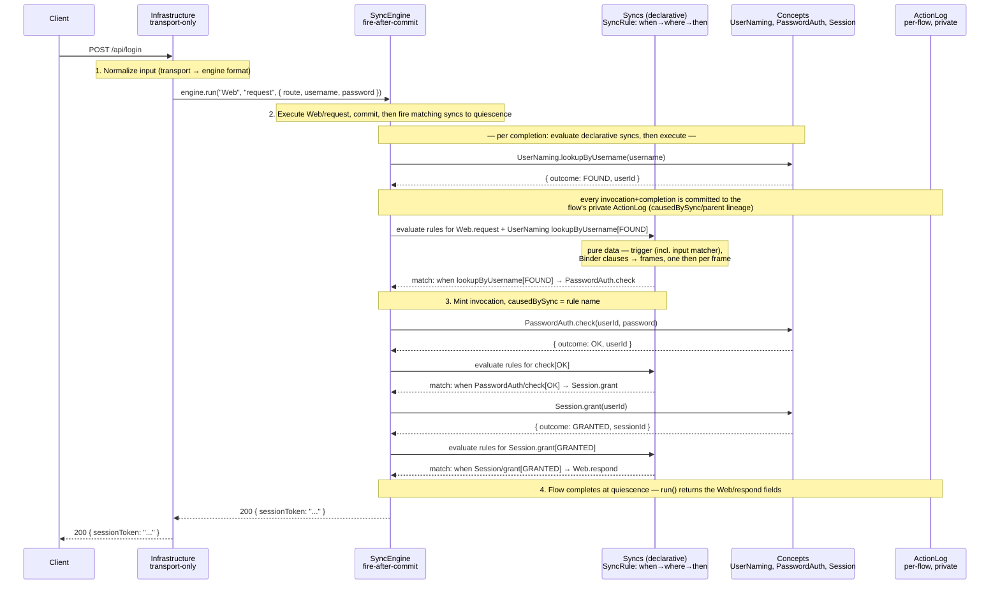

# CLAD — Contract-Led, Artefact-Driven Development

> A **harness-free agentic workflow** for building systems from a
> plain-language brief. One human steering, one AI coding agent executing,
> deterministic Python gates controlling the agent's feedback — not a
> framework controlling the agent. The systems it produces are built on Meng
> & Jackson's **concepts and synchronizations** (WYSIWID, Onward! 2025):
> fully decoupled, legible, and reviewable one screen at a time.

## The idea in one paragraph

CLAD answers the three questions any agentic workflow has to answer:

| Question | CLAD's answer |
|---|---|
| **What is deterministic?** | Everything mechanical. Python generators derive every artefact that is a pure function of earlier artefacts (syncs, data models, contracts, test scaffolds) — the model never authors them. Python gates check every stage transition, block test feedback on a skipped stage, and refuse a commit that decouples code from spec. |
| **What does the agent do?** | Only the judgement-laden residue: scoping actors and goals, writing the use case, decomposing it into concepts, and implementing red→green TDD against an executable spec it cannot edit to make tests pass. |
| **Where is the human?** | At exactly four points: answering a handful of scoping questions up front, and reviewing three gates per use case — Requirements, Architecture, Executable spec — each a set of markdown files on disk you can read, diff, and edit. |

The result: a complete RealWorld backend built by one agent for **$2.91 in
tokens, 0.2% rework, 0 cross-concept imports, 0 logic defects** — because the
workflow makes the wrong move unreachable instead of asking the model not to
make it.

**It runs.** The brief-to-system loop is exercised end-to-end by a bundled
reference stack: `legible-engine` (zero-dependency, fire-after-commit)
executing declarative syncs, with profiles for **plain Java** (a login
quick-start, no framework), the **canonical `java-legible`** multi-feature
service, and a **durable Micronaut + Postgres** deployment (concept state
derived from the Stage 03b data models, Docker/Fly.io). Same methodology,
swappable profile — proof the architecture is not tied to one stack.

## What's WYSIWID?

Meng & Jackson's WYSIWID paper (Onward! 2025) describes an architecture where
every system is decomposed into fully decoupled **concepts** — small state
machines with explicit operational principles — connected only by declarative
**synchronizations**. No concept imports another. A change to one concept has
a blast radius of exactly one concept. The code stays legible to humans and
LLMs alike.

The paper includes a reference Conduit implementation, demonstrating that
the architecture works. What it doesn't include is a way to *build* such
systems with an AI coding agent. CLAD is that missing piece — the staged
pipeline, human gates, and deterministic enforcement that turn a
plain-language brief into a WYSIWID-compliant system.

## How CLAD works

CLAD bridges three ideas into a single discipline: WYSIWID gives the
architecture. ICM gives the workspace scaffold (numbered stages, CONTEXT.md
contracts, the filesystem as state machine). CLAD adds the human-in-the-loop
flow — plain-language intent → chain of linked artefacts → executable spec →
running system, with deterministic Python scripts gating every transition.

The result is a state machine of stages punctuated by human review gates.
The human provides a brief and reviews artefacts at each gate; the agent reads
a stage contract, produces only the declared outputs, and stops. A rejection
sends work back to the earliest stage that owns the defect:


```mermaid
flowchart TD
    START(( ))
    subgraph S00["Stage 00 · system scope"]
        actors["actors + goals"]
    end
    G0{"Gate 0"}
    START --> S00 --> G0
    G0 -->|"reject"| S00
    G0 -->|"approved"| REQS
    subgraph REQS["Requirements"]
        direction LR
        USECASE["use case"] --> RMAP["responsibility map"] --> CHAIN["chain table"]
    end
    G1{"Gate 1"}
    REQS --> G1
    G1 -->|"reject"| REQS
    G1 -->|"approved"| ARCH
    subgraph ARCH["Architecture"]
        direction LR
        CONCS["concepts"] --> SYNCS["syncs"] --> DEP["dep. review"] --> DM["data model"]
    end
    G2{"Gate 2"}
    ARCH --> G2
    G2 -->|"reject"| ARCH
    G2 -->|"approved"| SPEC
    subgraph SPEC["Executable spec"]
        direction LR
        STORE["storage mapping"] --> SLICE["concept contract"] --> FLOW["flow tests"]
    end
    G3{"Gate 3"}
    SPEC --> G3
    G3 -->|"reject"| SPEC
    G3 -->|"approved"| DELIVERY
    subgraph DELIVERY["Delivery"]
        direction LR
        CTDD["concept TDD"] --> STDD["sync TDD"] --> VER["verify & close"]
    end
    DELIVERY --> END(( ))
```

One collaborative scoping gate for the system, then three review gates per
use case (Requirements → Architecture → Executable spec). Stage 00 runs
once per brief; stages 01–05 run once per in-scope goal. The full stage
table is in [`AGENTS.md`](AGENTS.md) §3; the artefact dependency graph is
in [`methodology/architecture/ARTEFACT_MAP.md`](methodology/architecture/ARTEFACT_MAP.md).

### Enforcement without a harness

CLAD embeds the same deterministic Python gate (`verify_artefacts.py`) into
three points on the agent's critical path. Each layer blocks a different
escape route — the agent can't do useful work without passing the one it's
currently blocked by:

| Layer | When it fires | What it blocks | Why the agent can't skip it |
|---|---|---|---|
| **1. Self-audit** | End of every stage | Advancing or presenting for review | Required by AGENTS.md principle 14 before `./clad advance` |
| **2. Test loop** | Every `test.command` | Test feedback | The agent must run tests to iterate; the gate is wired into `clad.properties` as `python3 quality-gate/verify_artefacts.py && mvn test` |
| **3. Commit hook** | Every `git commit` | The commit itself | Installed via `core.hooksPath`; `--no-verify` is banned by rule R18 |

The key insight: **CLAD controls feedback, not the agent.** An agent that
skips a stage doesn't get test results. An agent that never runs tests
can't write working code. An agent that can't commit can't deliver.

### Deterministic artefact generators

Where a stage's output is a *mechanical function* of earlier artefacts, CLAD
ships a Python generator so the model never has to author it. Stage
`CONTEXT.md` contracts mark the command with `Generated via:`:

| Stage | Generator | Emits |
|---|---|---|
| 03 syncs | `generate_syncs.py` | one `*.sync.md` per chain-table transition |
| 03a | `generate_sync_cards.py` | per-concept dependency cards + `pattern-d-summary.md` |
| 03b | `generate_data_model.py` | CSDP data models (types + constraints auto-derived from `--` annotations) |
| 04b | `generate_contract.py` | per-concept concept contracts |
| 04c | `generate_feature_files.py` | Gherkin scaffold |

The generator produces the derived skeleton verbatim (names, matrices,
signatures) and leaves `<TODO>` markers only where genuine design judgment is
required — e.g. Pattern D concept-state reads. Its output passes the same
stage's `verify_*` check by construction. Genuinely judgement-laden stages
(00 intake, 01 use case, 01a concept decomposition, 02 concept design) stay
model-authored. `quality-gate/describe_feature.py` emits a JSON descriptor of a
feature for downstream runtimes, keeping the parsing grammar in one place.

## What CLAD guarantees

1. **Requirements → code.** Every in-scope goal becomes a use-case
   scenario → chain table → concept specs + sync contracts → concept contracts +
   TDD tests → implementation. Nothing appears in code without a
   requirement upstream.

2. **Code → requirements.** Every runtime action emits a flow token.
   Stage 05 walks the token tree and proves the running system produced
   exactly the sequence the chain table predicted. Unauthorised actions
   are findings.

3. **Locally reviewable.** No concept imports another. Cross-concept
   coordination lives only in declarative syncs — `when X completes then
   Y`. A change's blast radius is visible in one sync file.

4. **Mechanically enforced.** The artefact gate blocks test feedback when
   a stage is skipped, a gate is unapproved, or implementation drifts from
   its spec. No harness, no framework-specific hooks — plain `python3`
    checks.

### Runtime architecture

Every HTTP request in a CLAD system flows through exactly one path.
Concepts do business work. Syncs **declare** coordination as declarative
records; the engine **performs** it after each commit — syncs participate
only through that evaluation (no sync ever calls into anything or holds
state; each synthesized invocation records `causedBySync`). Infrastructure
is transport-only.


```mermaid
sequenceDiagram
    participant Client
    participant Controller as Infrastructure<br/>transport-only
    participant Engine as SyncEngine<br/>fire-after-commit
    participant Syncs as Syncs (declarative)<br/>SyncRule: when→where→then
    participant Concepts as Concepts<br/>UserNaming, PasswordAuth, Session
    participant Log as ActionLog<br/>per-flow, private

    Client->>Controller: POST /api/login
    Note over Controller: 1. Normalize input (transport → engine format)
    Controller->>Engine: engine.run("Web", "request", { route, username, password })
    Note over Engine: 2. Execute Web/request, commit, then fire matching syncs to quiescence

    Note over Engine,Concepts: — per completion: evaluate declarative syncs, then execute —
    Engine->>Concepts: UserNaming.lookupByUsername(username)
    Concepts-->>Engine: { outcome: FOUND, userId }
    Note over Engine,Log: every invocation+completion is committed to the<br/>flow's private ActionLog (causedBySync/parent lineage)
    Engine->>Syncs: evaluate rules for Web.request + UserNaming lookupByUsername[FOUND]
    Note over Syncs: pure data — trigger (incl. input matcher),<br/>Binder clauses → frames, one then per frame
    Syncs-->>Engine: match: when lookupByUsername[FOUND] → PasswordAuth.check
    Note over Engine,Syncs: 3. Mint invocation, causedBySync = rule name
    Engine->>Concepts: PasswordAuth.check(userId, password)
    Concepts-->>Engine: { outcome: OK, userId }
    Engine->>Syncs: evaluate rules for check[OK]
    Syncs-->>Engine: match: when PasswordAuth/check[OK] → Session.grant
    Engine->>Concepts: Session.grant(userId)
    Concepts-->>Engine: { outcome: GRANTED, sessionId }
    Engine->>Syncs: evaluate rules for Session.grant[GRANTED]
    Syncs-->>Engine: match: when Session/grant[GRANTED] → Web.respond
    Note over Engine,Log: 4. Flow completes at quiescence — run() returns the Web/respond fields
    Engine-->>Controller: 200 { sessionToken: "..." }
    Controller-->>Client: 200 { sessionToken: "..." }
```

**What's forbidden** (enforced by `verify_action_log_isolation.py`):

| Violation | Example |
|---|---|
| Controller logs in or reads/writes concept state directly | Bypasses the engine; no flow token, untraceable |
| Controller references concept graph URIs or regions | `GRAPH <concept:article>` in infrastructure code |
| Controller contains business branching | `if (outcome.equals("OK"))` in a controller method |

There are only four things a controller is allowed to do: normalize input,
call `engine.run("Web", "request", …)`, read the returned `Web/respond`
fields, and translate them to the transport response. Everything else
belongs in concepts or syncs. On the canonical profile these rules are
asserted by `FlowTraceTest`-style tests plus the isolation checks; on the
legacy profile the equivalent is the `FlowManager`/`awaitResponse` pair.

### What a session looks like

From the [WALKTHROUGH](methodology/WALKTHROUGH.md) — an actual session building login via UC-00-login:

```
Human:  "I want to add login. Username and password. On success they get
         a session token. On failure, the error message must not reveal
         whether the username exists. After several failed attempts the
         account locks for a while."

Agent:  I read one in-scope actor: EndUser. I read three in-scope goals:
        Sign In, See Safe Failure Message, Understand Lockout.
        
        Before I write anything, four questions:
        1. Is EndUser the only actor — no admin / operator?
        2. Is lockout a goal or just a mechanism?
        3. Is logout in scope?
        4. Is the username opaque (no email semantics)?

Human:  "1) yes; 2) goal — they need to understand why retries fail;
         3) out of scope; 4) opaque."

Agent:  [writes actors.md and goals.md to output/]
        "Do you agree with this step? Any corrections before I continue?"
```

The agent then walks stage by stage through the numbered CONTEXT.md
contracts — proposing, writing, and stopping at each of three human
gates for review (Requirements, Architecture, Executable spec). Each
gate produces files on disk you can diff, edit, and approve. The full
turn-by-turn session is in
[`methodology/WALKTHROUGH.md`](methodology/WALKTHROUGH.md).

## Quick start

```bash
git clone https://github.com/abratto/clad.git
cd clad
```

**One-time setup.** Activate the pre-commit hook so `git commit` refuses
commits that skip a stage or decouple code from its spec:

```bash
./quality-gate/install-hooks.sh
```

A blocked commit is a real defect — fix it, do not bypass it.

**Two prompts to start.** After cloning, open a chat with any AI coding
agent (Copilot, Claude, Cursor, OpenCode, …) in this workspace:

1. Send: `Read AGENTS.md in full and follow it, then wait for my brief.`
2. Send: `I want to build <one paragraph describing what the system should let users do>. Run system-scope Stage 00.`

The agent runs Stage 00 at system scope — proposes actors and goals, asks
clarifying questions, and writes nothing until you approve. After that,
the agent creates one `features/UC-XX-<slug>/` folder per in-scope goal and
walks each through stages 01–05, pausing only at the three human gates.
Steer in plain language: "what's next", "let's do UC-02", "redo the syncs".

**Reading order** (if you want the full picture):
[`AGENTS.md`](AGENTS.md) → [`methodology/README.md`](methodology/README.md) →
[`methodology/WALKTHROUGH.md`](methodology/WALKTHROUGH.md) →
[`features/UC-00-login/README.md`](features/UC-00-login/README.md)

### Requirements

| What you want to do | What you need |
|---|---|
| Use CLAD as a methodology starter | Git, an editor, an AI coding agent |
| Run the quality-gate scripts | Python 3 |
| Run the Java reference profile | Java 21 + Maven |

### Configuration

Edit [`clad.properties`](clad.properties) at the repo root to set
project-wide defaults:

```properties
# The canonical test command — runs the artefact gate before tests.
# This repo scopes it to the canonical profile so the gate runs without Docker;
# set it to your own project's test command.
test.command=python3 quality-gate/verify_artefacts.py && mvn test -f reference-impl/pom.xml -pl java-legible -am

# Describe your persistence technology.
storage.layer=In-memory FactStore relations (canonical fire-after-commit profile)

# How advance.py handles human gates and session boundaries.
workflow.autonomous=false
workflow.session-per-stage=false
```

## Status

CLAD is **public, pre-1.0, and still evolving.** It ships a complete
methodology loop, agent guides, a worked example
([`features/UC-00-login/`](features/UC-00-login/README.md)), and a tiered
reference stack under
[`reference-impl/`](reference-impl/README.md) on the zero-dependency
fire-after-commit engine (`dev.legible.engine`): [`java-plain/`](reference-impl/java-plain/)
(a plain-Java quick-start: the login feature only, no framework — the
transport surface is a method call), the canonical multi-feature
[`java-legible/`](reference-impl/java-legible/) profile (the recommended
implementation), and a durable deployable
[`java-micronaut-postgres/`](reference-impl/java-micronaut-postgres/)
profile — Micronaut for the HTTP transport, Postgres concept state derived
from the Stage 03b data models (R-map), with a `Dockerfile` +
`docker-compose.yml` and a `fly.toml` for Fly.io. The legacy
transactional RDF/SPARQL (Jena) profile was **retired** — it is no longer
built, checked, or maintained, and remains available only at tag `v0.4.0`
(see [`reference-impl/LEGACY.md`](reference-impl/LEGACY.md)). The
methodology is profile-agnostic. Pre-1.0 CLAD
releases may include breaking methodology changes. This repository uses
[Semantic Versioning](https://semver.org/) and annotated Git tags;
downstream CLAD-based projects define their own release policy. See
[CHANGELOG.md](CHANGELOG.md) for CLAD upgrade notes.

### Built with CLAD

A complete [RealWorld Conduit](https://github.com/gothinkster/realworld)
backend (7 use cases, 40+ sync agents, 36 Cucumber scenarios) was built with
CLAD by a single agent under human review:
[`abratto/clad-realworld-conduit-app`](https://github.com/abratto/clad-realworld-conduit-app).
**$2.91 total token cost, 0.2% rework, 74% coverage, 0 cross-concept imports,
0 logic defects** — ~20–50× cheaper than typical agentic workflows.

CLAD was created by **Alan Potosnak**. See [`NOTICE`](NOTICE) and
[`methodology/reference/CITATIONS.md`](methodology/reference/CITATIONS.md).

CLAD works with any agent framework. Agents that support
[agentskills.io](https://agentskills.io) auto-discover CLAD skills from
the `skills/` directory. No platform-specific configuration is required.

## Repository layout

```
clad/
├── README.md
├── AGENTS.md                        Canonical agent guide (single source)
├── CLAUDE.md                        Adapter -> AGENTS.md
├── .github/copilot-instructions.md  Adapter -> AGENTS.md
├── .cursor/rules/clad.mdc           Adapter -> AGENTS.md
├── clad.properties                  Project-wide settings
├── CONTEXT.md                       Workspace routing
├── skills/                          Portable agent skills (agentskills.io)
├── quality-gate/                    Deterministic Python checks
│
├── methodology/
│   ├── core/                        CLAD: contracts, artefacts, principles
│   ├── architecture/                Legible/WYSIWID + ARTEFACT_MAP.md
│   ├── implementation/              Hard rules, stages, quality gate
│   ├── overlays/                    Optional: tracking, planning, decisions, ports/adapters
│   └── reference/                   Citations and sources
│
├── templates/                       Per-artefact templates
│   ├── feature-skeleton/            Copy this to start a new feature
│   ├── plan-board.md                Optional sequencing board
│   └── ...
│
├── features/
│   ├── _system/                     System-level Stage 00 (run once per brief)
│   └── UC-00-login/                 Worked example (stages 00–05)
│
└── reference-impl/
    ├── legible-engine/             Canonical engine (dev.legible.engine, zero-dependency)
    ├── java-plain/                 Plain-Java quick-start (login only, no framework)
    ├── java-legible/               Canonical profile — recommended
    ├── java-micronaut-postgres/    Durable profile (Micronaut + R-map Postgres, Docker/Fly.io)
    ├── legible-storage/            FactStore backends (Jena / Postgres)
    └── LEGACY.md                   Retired Jena/RDF stack pointer (last at v0.4.0)
```

## License

Apache License 2.0. See [LICENSE](LICENSE) and [NOTICE](NOTICE).

## Citations

- Meng, E. & Jackson, D. (2025). *What You See Is What It Does: A Structural
  Pattern for Legible Software.* Onward! 2025.
  [DOI 10.1145/3759429.3762628](https://doi.org/10.1145/3759429.3762628) ·
  [arXiv 2508.14511](https://arxiv.org/abs/2508.14511)
- Van Clief, J. (2026). *Interpretable Context Methodology (ICM).*
  [arXiv 2603.16021](https://arxiv.org/abs/2603.16021) ·
  [github.com/RinDig/Interpretable-Context-Methodology-ICM-](https://github.com/RinDig/Interpretable-Context-Methodology-ICM-)
