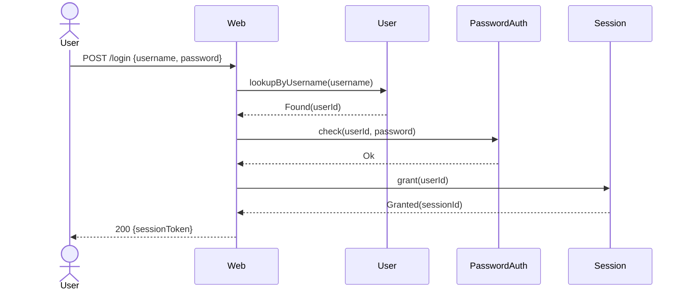

# Chain table — `successful-login`

## Scenario

`successful-login` — `POST /login` with valid `{ username, password }`
for a registered user whose account is not locked.

## Chain

| # | Concept | Action | Inputs | Outcome | Why this step |
|---|---|---|---|---|---|
| 1 | `Web` | `handle` | `POST /login`, `{ username, password }` | `Routed` | Sole HTTP entry (R4) |
| 2 | `User` | `lookupByUsername` | `username` | `Found(userId)` | Need the opaque `userId` before any auth check |
| 3 | `PasswordAuth` | `check` | `userId`, `password` | `Ok` | Verify the credential |
| 4 | `Session` | `grant` | `userId` | `Granted(sessionId)` | Open a fresh session for the verified user |
| 5 | `Web` | `respond` | `200`, `{ sessionToken: sessionId }` | `Sent` | Closes the request with the new token |

## Diagram

## Cross-checks

- All four concepts are listed in
  `../02a_responsibility-map/output/responsibility-map.md` and the
  scenario `successful-login` lists all four under *Coverage check*.
- All five action calls use action names declared in the
  responsibility map.
- The first row is `Web.handle`; the last row is `Web.respond` (R4).

## Notes

- Steps 2–4 are sequential because each depends on the previous
  outcome. Stage 03 will lift the inter-step coordination into
  syncs (one per arrow, three syncs in total for the happy path).
