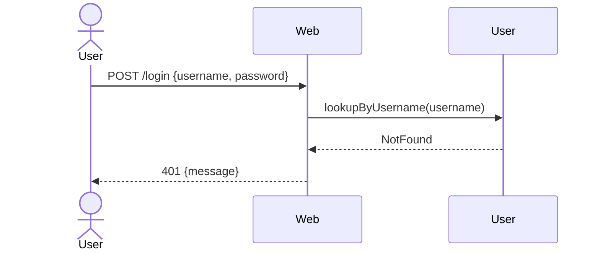

# Chain table — `unknown-user`

## Scenario

`unknown-user` — `POST /login` with a username that has no
registered user.

## Chain

| # | Concept | Action | Inputs | Outcome | Why this step |
|---|---|---|---|---|---|
| 1 | `Web` | `handle` | `POST /login`, `{ username, password }` | `Routed` | Sole HTTP entry (R4) |
| 2 | `User` | `lookupByUsername` | `username` | `NotFound` | Username does not exist |
| 3 | `Web` | `respond` | `401`, `{ message: "username or password didn't match" }` | `Sent` | Same opaque message as `wrong-password` (no enumeration leak) |

## Diagram

## Cross-checks

- `Web` and `User` are listed in the responsibility map and
  `unknown-user` lists both under *Coverage check*.
- No `PasswordAuth.check` row — we never attempt verification when
  the username does not exist (this is what makes the timing-channel
  hardening someone else's problem).

## Notes

- The 401 body is identical to `wrong-password`'s. Stage 03 expresses
  this with two separate syncs that emit the same response template;
  the message constant is shared in code, not the rule.
