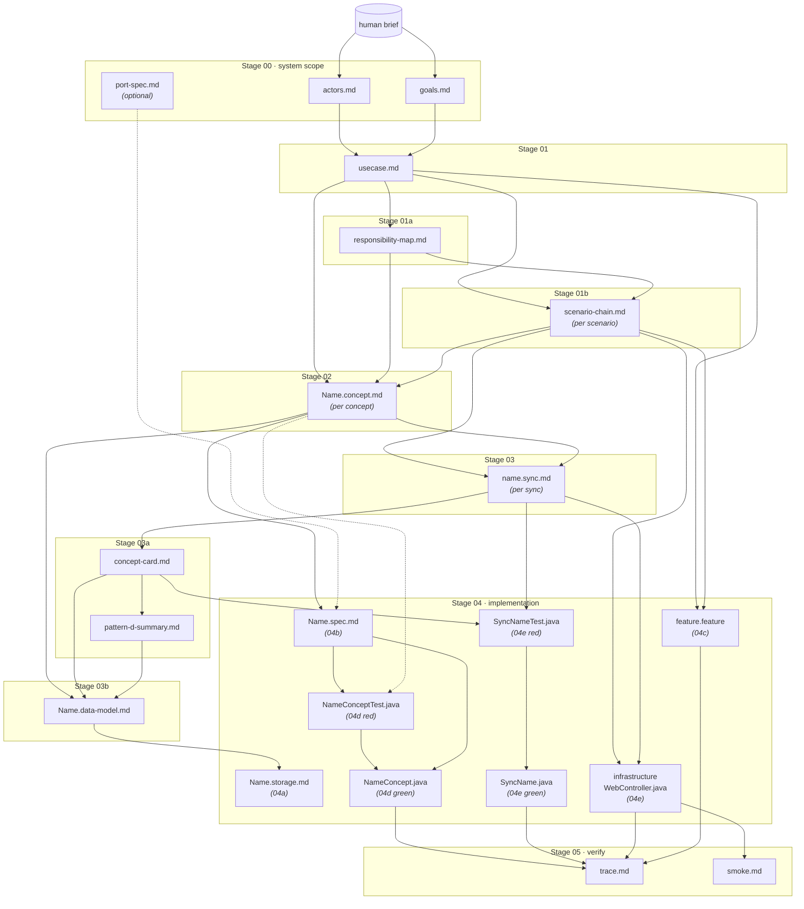

# TRACEABILITY.md — artefact-to-architecture-to-code mapping

This file answers four questions for every CLAD artefact:

1. **Where does it come from?** — what upstream artefacts must exist before
   this one can be produced.
2. **What WYSIWID concept does this realize?** — the architectural role
   (concept state machine, declarative sync, bootstrap entry/exit, flow
   token, external contract).
3. **How do I know it's correct?** — the test or quality-gate check that
   proves this artefact is faithful to its upstream source and the
   architecture.
4. **Where does it live in running code?** — the runtime counterpart in
   a typical profile (Java/Micronaut/Jena shown; the mapping generalizes).

Use this alongside [`ARTEFACT_MAP.md`](ARTEFACT_MAP.md) (detailed producer→consumer
edges with the specific data each consumer reads) and
[`STAGES.md`](../implementation/STAGES.md) (stage sequence).
Together they form the complete traceability chain.

---

## The mapping

| Stage | Artefact | Depends on (upstream) | WYSIWID concept it realizes | How it's verified | Runtime code |
|---|---|---|---|---|---|
| 00 | `actors.md` | Human brief | (system boundary) | Human review at Gate 0 | — |
| 00 | `goals.md` | Human brief, `actors.md` | (system boundary) | Human review; `verify_scenario_coverage.py` checks goal→scenario coverage | — |
| 01 | `usecase.md` | `goals.md`, `actors.md` | Cockburn use case — trigger, actors, scenarios, postconditions | `verify_scenario_coverage.py` checks every goal has a scenario; human review at Gate 1 | — |
| 01a | `responsibility-map.md` | `usecase.md` | Concept discovery — which concepts exist, what state they track, what actions they expose | `verify_file_manifest.py` | — |
| 01b | `<scenario>-chain.md` | `usecase.md`, `responsibility-map.md` | Action choreography — the predicted runtime sequence of actions and outcomes | `verify_outcome_alignment.py` checks outcomes match SPEC; `verify_step_definition_derivation.py` checks chain actions appear in step defs | — |
| 02 | `<Name>.concept.md` | `usecase.md`, `responsibility-map.md`, `<scenario>-chain.md` | Concept state machine — state (Alloy-like relations), actions (case-split outcomes, pre/post), operational principle (witness trace) | `verify_outcome_alignment.py`; 04d tests assert post-conditions as field values (R14); 05 back-traces flow tokens against operational principle | `state` → `<Name>Concept.java` fields + named-graph triples; `actions` → public methods each emitting a flow token; `operational principle` → `<Name>ConceptTest.java` |
| 03 | `<name>.sync.md` | `<scenario>-chain.md`, `<Name>.concept.md` | Declarative sync — "when ConceptA.completes → then ConceptB.action" | `verify_sync_matrix.py` checks contract matrix completeness; `verify_sync_route_filters.py` checks shared-trigger route scoping (R11); `verify_sync_declarative.py` catches imperative branching (R3) | `<SyncName>.java` extends `SyncAgent` — `whereClause()` + `thenBindings()` in SPARQL |
| 03a | `<concept>-card.md` | `<name>.sync.md` (all syncs, read-only) | Dependency review — inbound calls + concept-state reads per concept | `verify_sync_route_filters.py`; human review at Gate 2 | — |
| 03a | `pattern-d-summary.md` | `<concept>-card.md` (all cards) | Dependency review — complete cross-concept coupling surface (concept-state reads only) | Human review; empty list is a valid (and common) result | — |
| 03b | `<Name>.data-model.md` | `<Name>.concept.md`, `<concept>-card.md`, `pattern-d-summary.md` | Conceptual data model — CSDP fact types and constraints per concept | `verify_data_model.py` checks all 7 CSDP steps present | Named-graph schema |
| 04a | `<Name>.storage.md` | `<Name>.data-model.md` | Storage mapping — CSDP facts → profile-specific schema | Profile-specific | RDF named graph IRI per concept (Jena); SQL table per concept (relational) |
| 04b | `<Name>.spec.md` | `<Name>.concept.md` | SPEC slice — action signatures, outcome enums, flow-token shape (stripped of prose) | `verify_spec_parity.py` checks action parity with concept specs; `verify_outcome_alignment.py` checks outcomes match chain tables | Compiled-against by 04d/04e tests |
| 04b | `spec.md` §Response shapes | `port-spec.md` (when present) | Port-spec contract — exact JSON paths/types/error envelopes per HTTP endpoint | `verify_port_spec_contract.py` when `port-spec.md` exists | `@Contract` Cucumber scenarios in 04c |
| 04c | `<feature>.feature` | `usecase.md` (scenarios), `<scenario>-chain.md` | BDD outer-red test — one Gherkin scenario per use-case scenario, derived from chain table | `verify_gherkin_derivation.py` checks derivation rules G1–G5; `verify_step_definition_parity.py` catches empty stubs; `verify_cucumber_green.py` (at 04e) enforces all-green | Cucumber runner + `<Feature>StepDefinitions.java` |
| 04d | `<Name>ConceptTest.java` | `<Name>.spec.md`, `<Name>.concept.md` (operational principle) | Concept TDD — inner red (tests) then green (implementation) | `verify_concept_test_derivation.py` checks every SPEC outcome has a test; `verify_concept_field_assertions.py` checks test asserts field values (R14/R16) | Runs against `<Name>Concept.java` |
| 04d | `<Name>Concept.java` | `<Name>.concept.md`, `<Name>.spec.md`, `<Name>ConceptTest.java` | Concept implementation — state machine with `writeCompletion()` emitting flow tokens | Concept tests pass; `verify_action_log_isolation.py` checks infrastructure doesn't bypass the engine (R4) | Called by `SyncDispatcher` |
| 04e | `<SyncName>Test.java` | `<name>.sync.md`, `<concept>-card.md` | Sync TDD — inner red (tests) then green (implementation) | Sync tests pass | Runs against `<SyncName>.java` |
| 04e | `<SyncName>.java` | `<name>.sync.md`, `<SyncName>Test.java` | Sync implementation — declarative SPARQL where/then clauses | `verify_implementation_parity.py` checks spec↔code pairing; `verify_sync_implementation_parity.py` checks every Stage 03 sync has a Java class; `verify_sync_variable_names.py` checks reserved SPARQL variables (R10) | Registered with `SyncDispatcher` |
| 04e | Infrastructure controller | `<scenario>-chain.md` (routes), `<name>.sync.md` (respond syncs) | Bootstrap concept adapter — translates HTTP → engine → HTTP (normalize input, `rootAction()`, `awaitResponse()`, translate output) | `verify_action_log_isolation.py` catches raw ActionLog access (R4); ArchUnit catches concept imports | `WebController.java`, `AuthController.java`, etc. |
| 05 | `trace.md` | All implementation, `<feature>.feature` | Flow-token back-trace — proves runtime action sequence matches chain table | Human review; `verify_cucumber_green.py` already proved all scenarios green | Runs against deployed artefact |
| 05 | `smoke.md` | Running system | Deployable proof — real recorded HTTP calls + responses | Human review | `curl` or Hurl against running system |
| — | `port-spec.md` (optional, Stage 00) | External API contract | Imposed response shapes the system must satisfy | `verify_port_spec_contract.py` checks 04b response shapes and 04c `@contract` scenarios | External oracle (Hurl, Postman, etc.) |

---

## Dependency graph

How artefacts flow from human brief to running code. Each arrow reads
"produces → consumed by":

Dashed lines (`-.->`) indicate read-only references — the downstream
artefact names the upstream one but doesn't depend on it being produced
first (e.g. the concept spec informs the test's expectations, but the
test is produced in the same stage).

---

## How to read this

**Down a column** (what happens to one artefact):
`usecase.md` → depends on goals + actors → realized as Cockburn use case → verified by scenario coverage → no runtime code.

**Across a row** (what one WYSIWID concept needs):
Concept state machines need: state (02) → data model (03b) → storage mapping (04a) → concept class (04d). All verified by `verify_data_model.py` + `verify_concept_field_assertions.py`.

**For an LLM mid-session:**
Pick the stage you're on, scan the row for that artefact, and confirm you have its upstream dependencies loaded, know where its verification lives, and know what runtime code it will produce. If any column is blank or unknown, stop — you're about to produce an artefact that can't be verified or implemented.

---

## Key enforcement scripts mapped to architecture rules

| Script | Architecture rule | What it prevents |
|---|---|---|
| `verify_action_log_isolation.py` | R4 (Web is sole HTTP entry; infrastructure is transport-only) | Controllers bypassing the engine with raw SPARQL |
| `verify_sync_declarative.py` | R3 (syncs are declarative, not imperative) | if/switch/for in sync classes; `*Coordinator`/`*Orchestrator` classes |
| `verify_sync_route_filters.py` | R11/R15 (shared-trigger syncs must filter by route) | Login sync firing for register flow |
| `verify_sync_variable_names.py` | R10 (use engine's reserved SPARQL variable names) | Wrong flow token written by sync |
| `verify_concept_field_assertions.py` | R14/R16 (tests must assert field values, not just outcomes) | Silent field-mapping bugs passing outcome-only tests |
| `verify_implementation_parity.py` | R17 (implementation and spec change together) | Java sync with no `.sync.md` artefact |
| ArchUnit `LegibleArchitectureRulesTest` | R1 (no concept imports another), R2 (one persistence region per concept), R4 (controllers don't import concepts) | Cross-concept imports, HTTP annotations outside infrastructure |
