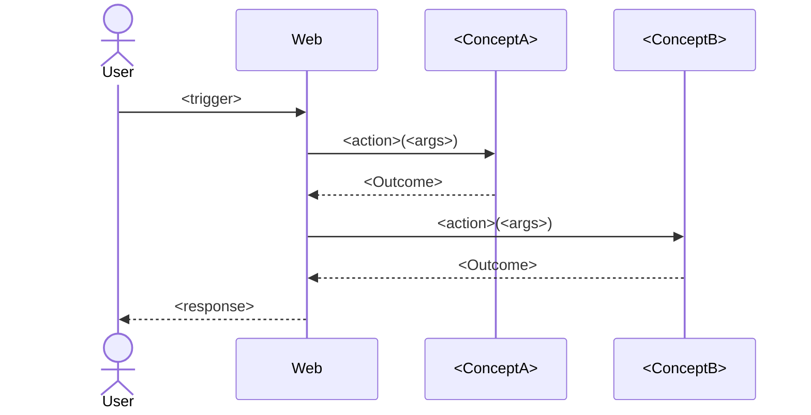

<!-- Template for Stage 02b (02b_chain-table). Purpose: see methodology/architecture/CONCEPTS.md, methodology/architecture/SYNCHRONIZATIONS.md, and methodology/implementation/STAGES.md §"Stage 02b". -->

# Chain table — `<scenario-name>`

> One file per scenario from `../01_usecase/output/usecase.md`. The
> chain table is the artefact that lets a human verify
> *"yes, that is the correct sequence of action invocations for this
> scenario"* **before** any sync is written. It is the bridge between
> the use case's prose scenarios and Stage 03's coordination rules.
>
> Keep each row to one action. If a row needs to say
> "and also …", add another row.

## Scenario

`<scenario-name>` — copy the trigger line from
`../01_usecase/output/usecase.md` so the table is self-contained.

## Chain

| # | Concept | Action | Inputs | Outcome | Why this step |
|---|---|---|---|---|---|
| 1 | `Web` | `handle` | `<route>`, `<request body>` | `Routed` | The HTTP entry point (R4) |
| 2 | `<Name>` | `<actionName>` | `<args>` | `<Outcome>` | <one-line justification> |
| 3 | `<Name>` | `<actionName>` | `<args>` | `<Outcome>` | … |
| 4 | `Web` | `respond` | `<status>`, `<body>` | `Sent` | Closes the request |

> The `Why this step` column is what the human reviews. If you cannot
> name a reason, the step probably does not belong.

## Diagram (optional but encouraged)

## Cross-checks

- Every concept that appears in the table is also a row in
  `../02a_responsibility-map/output/responsibility-map.md`.
- Every action that appears in the table is listed in the
  corresponding `<Name>.concept.md` (Stage 02) once that file exists.
- The trigger and the final response match the scenario's *Trigger*
  and *Expected outcomes* in `../01_usecase/output/usecase.md`.

## Notes

> Optional. Open questions for the human reviewer, alternatives
> rejected, etc.
