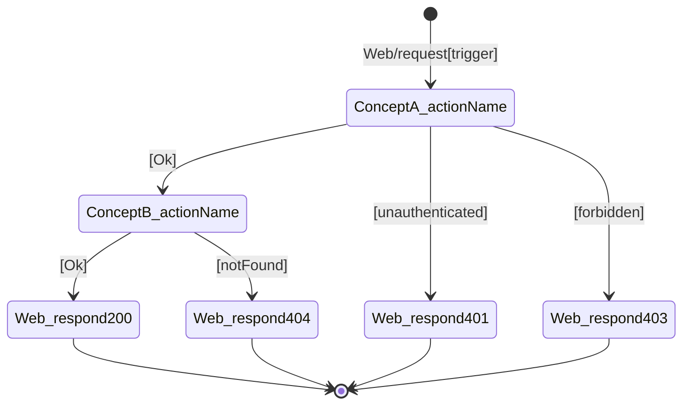

<!-- Template for Stage 02b (02b_chain-table). Purpose: see methodology/architecture/CONCEPTS.md, methodology/architecture/SYNCHRONIZATIONS.md, and methodology/implementation/STAGES.md §"Stage 02b chain-table". Fill every placeholder; delete this comment before committing. -->

# Chain table — `<scenario-name>`

> One file per scenario from `../01_usecase/output/usecase.md`. The
> chain table is the artefact that lets a human verify
> *"yes, that is the correct sequence of action invocations for this
> scenario"* **before** any sync is written. It is the bridge between
> the use case's prose scenarios and Stage 03's coordination rules.
>
> Keep each row to one action. If a row needs to say
> "and also …", add another row.

## Scenario

`<scenario-name>` — copy the trigger line from
`../01_usecase/output/usecase.md` so the table is self-contained.

## Chain

| # | When | Then | Inputs | Outcome | Why this step |
|---|---|---|---|---|---|
| 1 | `Web/request[<route>]` | `Web.handle` | `<route>`, `<request body>` | `Routed(<carried fields>)` | The HTTP entry point (R4) |
| 2 | `Web.handle[Routed(<carried fields>)]` | `<Name>.<actionName>` | `<args>` | `<Outcome>` | <one-line justification> |
| 3 | `<PreviousName>.<previousAction>[<Outcome>]` | `<Name>.<actionName>` | `<args>` | `<Outcome>` | … |
| 4 | `<Name>.<actionName>[<Outcome>]` | `Web.respond[<status>]` | `<status>`, `<body>` | `Sent` | Closes the request |

> **Why this shape is Level 2b, not Level 3a.**
> - The row's `Then` is the concrete rendering of the WYSIWID Level 2b
>   **Then**.
> - The row's `When` is explicit so the choreography can be reviewed
>   without mentally reconstructing the trigger edge.
> - If a downstream action needs request-originated values, the row's
>   `When`/`Outcome` contract must name those carried fields explicitly
>   (for example `Routed(email, password)`). Stage 03 may bind only from
>   names already declared by the approved trigger contract.
> - `Inputs` show the action's implementation-facing arguments only.
>   They are **not** provenance, join logic, or sync bindings.
> - Stage 03 is the first place where `where` provenance and the
>   A/B/C/D pattern labels are formalised.
>
> The `Why this step` column is what the human reviews. If you cannot
> name a reason, the step probably does not belong.

## Diagram (optional but encouraged)

> **Diagram type: `stateDiagram-v2` only.** Do NOT use `sequenceDiagram`.
> The chain table is a finite state machine; `stateDiagram-v2` makes
> branching and failure paths visible at a glance. See translation rules
> below. Validate at [mermaid.live](https://mermaid.live) before committing.

## Cross-checks

- Every concept that appears in the table is also a row in
  `../02a_responsibility-map/output/responsibility-map.md`.
- Every `Then` action that appears in the table is listed in the
  corresponding `<Name>.concept.md` (Stage 02) once that file exists.
- The trigger and the final response match the scenario's *Trigger*
  and *Expected outcomes* in `../01_usecase/output/usecase.md`.

## Notes

> Optional. Open questions for the human reviewer, alternatives
> rejected, etc.

---

## The chain table is a finite state machine

A well-formed chain table is structurally equivalent to an FSM. This
is not a metaphor — it is a property a reviewer can check by
inspection of the table alone, before any sync is written.

- **States** = action outcomes, typed as `Ok`/`<NamedFailure>`. The
  initial state is the row-1 `Web/request -> Web.handle` handoff; the
  terminal states are `Web.respond` invocations (success or failure).
- **Events** = the outcomes that completing actions emit
  (`Ok`, `BadPassword`, `NotFound`, …). Every completion emits
  exactly one event; every event triggers at most one transition per
  sync.
- **Transitions** = each row's explicit `When -> Then` edge.

A chain table with no ambiguous transitions, no unreachable states,
and no missing failure paths is a well-formed FSM — and therefore a
correct skeleton for the syncs at Stage 03.

### Deriving Stage 03 syncs from the chain table

Stage 03 turns the Level 2b `When -> Then` structure into
explicit sync rules:

1. Row 1 is the root `Web.handle` entry. It is **not** itself a sync.
2. Every non-root row becomes one Stage 03 `then` target.
3. The matching Stage 03 `when` is copied from the row's explicit
  `When` token.
4. Stage 03 adds `where` provenance only when the downstream action
  needs data not carried directly by the triggering outcome.

If a non-root row needs request-originated data, Stage 02b must expose
that data as named carried fields on the approved trigger token before
Stage 03 begins. Stage 03 must not recover missing names by reaching
back into raw HTTP/body structure.

So Stage 02b answers *what fires what*; Stage 03 adds *where each
argument came from*.

### The table is canonical; the diagram is derived

The Mermaid diagram above is a **derived view**. The table is the
diffable source of truth: a PR diff of the table shows exactly which
transitions changed, with no rendering tool required, and an LLM can
read/write/validate the table without ambiguity. If the table and the
diagram disagree, the table wins.

When you change the table, regenerate the diagram. The translation is
mechanical:

1. Each row's `Then` action becomes a state node (replace `.` with `_` so
   Mermaid will accept it: `Account_validate`).
2. Each transition `row N → row N+1` becomes an arrow labelled with
   row N's `Outcome` in brackets: `[Ok]`, `[AccountExists]`, etc.
3. The first row's trigger comes from `[*]`; every terminal
   `Web.respond` returns to `[*]`.
4. Failure branches from the same state appear as additional arrows
   from that state node, each labelled with their failure outcome.
5. Validate the resulting `stateDiagram-v2` block by pasting it into
   [mermaid.live](https://mermaid.live) before commit. A diagram that
   does not render must not be committed.

### Same-turn surfacing rule

The chain table **and** its diagram must be presented in the **same
conversation turn** when handing off for review. Splitting them
across turns is not permitted: the gate at Stage 02b covers both
artefacts together, and a gate cannot be opened over an incomplete
picture. One scenario = one chain-table file = one table + one
diagram.
