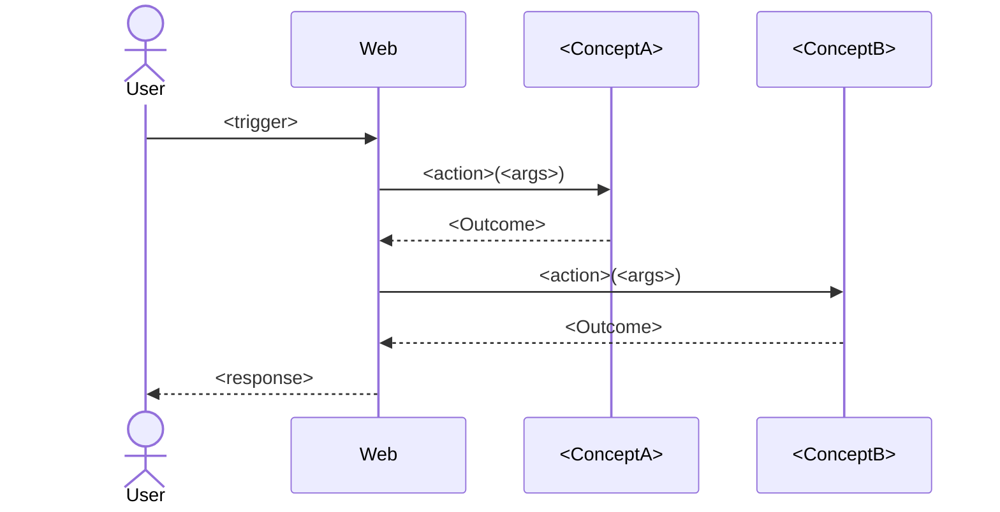

<!-- Template for Stage 02b (02b_chain-table). Purpose: see methodology/architecture/CONCEPTS.md, methodology/architecture/SYNCHRONIZATIONS.md, and methodology/implementation/STAGES.md §"Stage 02b". -->

# Chain table — `<scenario-name>`

> One file per scenario from `../01_usecase/output/usecase.md`. The
> chain table is the artefact that lets a human verify
> *"yes, that is the correct sequence of action invocations for this
> scenario"* **before** any sync is written. It is the bridge between
> the use case's prose scenarios and Stage 03's coordination rules.
>
> Keep each row to one action. If a row needs to say
> "and also …", add another row.

## Scenario

`<scenario-name>` — copy the trigger line from
`../01_usecase/output/usecase.md` so the table is self-contained.

## Chain

| # | Concept | Action | Inputs | Outcome | Where | Key | Why this step |
|---|---|---|---|---|---|---|---|
| 1 | `Web` | `handle` | `<route>`, `<request body>` | `Routed` | — | — | The HTTP entry point (R4) |
| 2 | `<Name>` | `<actionName>` | `<args>` | `<Outcome>` | `A: Web.handle.body → username` | flow token | <one-line justification> |
| 3 | `<Name>` | `<actionName>` | `<args>` | `<Outcome>` | `B: result_of(<#2>).userId` | flow token | … |
| 4 | `Web` | `respond` | `<status>`, `<body>` | `Sent` | — | — | Closes the request |

> The `Where` and `Key` columns label the
> [four sync data-flow patterns](../methodology/architecture/SYNC_PATTERNS.md):
> `A:` flow-token join (read the original `Web.handle` body),
> `B:` flow-sibling join (read an earlier action's output),
> `C:` sync constant (literal value baked into the rule),
> `D:` concept-state join (read another concept's named region — the
> only inter-concept read; surfaces in Stage 03a).
> Use `—` if the row needs no extra data.
>
> The `Why this step` column is what the human reviews. If you cannot
> name a reason, the step probably does not belong.

## Diagram (optional but encouraged)

## Cross-checks

- Every concept that appears in the table is also a row in
  `../02a_responsibility-map/output/responsibility-map.md`.
- Every action that appears in the table is listed in the
  corresponding `<Name>.concept.md` (Stage 02) once that file exists.
- The trigger and the final response match the scenario's *Trigger*
  and *Expected outcomes* in `../01_usecase/output/usecase.md`.

## Notes

> Optional. Open questions for the human reviewer, alternatives
> rejected, etc.

---

## The chain table is a finite state machine

A well-formed chain table is structurally equivalent to an FSM. This
is not a metaphor — it is a property a reviewer can check by
inspection of the table alone, before any sync is written.

- **States** = action outcomes, typed as `Ok`/`<NamedFailure>`. The
  initial state is the `Web.handle` invocation; the terminal states
  are `Web.respond` invocations (success or failure).
- **Events** = the outcomes that completing actions emit
  (`Ok`, `BadPassword`, `NotFound`, …). Every completion emits
  exactly one event; every event triggers at most one transition per
  sync.
- **Transitions** = the `Action` column in the next-numbered row.

A chain table with no ambiguous transitions, no unreachable states,
and no missing failure paths is a well-formed FSM — and therefore a
correct skeleton for the syncs at Stage 03.

### The table is canonical; the diagram is derived

The Mermaid diagram above is a **derived view**. The table is the
diffable source of truth: a PR diff of the table shows exactly which
transitions changed, with no rendering tool required, and an LLM can
read/write/validate the table without ambiguity. If the table and the
diagram disagree, the table wins.

When you change the table, regenerate the diagram. The translation is
mechanical:

1. Each row's `Action` becomes a state node (replace `.` with `_` so
   Mermaid will accept it: `User_lookupByUsername`).
2. Each transition `row N → row N+1` becomes an arrow labelled with
   row N's `Outcome`.
3. The first row's trigger comes from `[*]`; every terminal
   `Web.respond` returns to `[*]`.
4. Validate the resulting `stateDiagram-v2` block by pasting it into
   [mermaid.live](https://mermaid.live) before commit. A diagram that
   does not render must not be committed.

### Same-turn surfacing rule

The chain table **and** its diagram must be presented in the **same
conversation turn** when handing off for review. Splitting them
across turns is not permitted: the gate at Stage 02b covers both
artefacts together, and a gate cannot be opened over an incomplete
picture. One scenario = one chain-table file = one table + one
diagram.
