<!-- Template for consolidated chain (derived from Stage 02b per-scenario chains). Purpose: supplemental implementation safety view showing all scenario outcomes in one branching table and FSM diagram. This artefact is non-canonical; per-scenario chain files remain authoritative. -->

# Consolidated chain — `<use-case-name>`

> **Status: Derived, non-canonical view.** This file consolidates all scenarios from the per-scenario chain files into a single branching table and finite state machine diagram. It aids implementation review (Stages 03–04) by showing complete outcome coverage at a glance. The per-scenario `<scenario>-chain.md` files remain canonical for traceability to the use case.
>
> When the use case has 2+ scenarios, generate this file alongside (not instead of) the per-scenario chains.

## Scenarios covered

- `<scenario-1-name>` (main flow)
- `<scenario-2-name>` (error path)
- `<scenario-3-name>` (error path)
- …

## Consolidated chain

| # | Scenario | When | Then | Outcome | Why this path |
|---|---|---|---|---|---|
| 1 | all | `Web/request[<route>]` | `<Concept1>/<action1>` | `<outcome>` | Entry point (R4) |
| 2 | main, scenario-X | `<outcome-from-#1>[ok]` | `<Concept2>/<action2>` | `<outcome>` | Happy path continuation |
| 2a | scenario-Y | `<outcome-from-#1>[error:X]` | `Web/respond[code]` | `Sent` | Short-circuit error |
| 3 | main | `<outcome-from-#2>[ok]` | `<Concept3>/<action3>` | `<outcome>` | Next step (happy path) |
| 3a | scenario-Z | `<outcome-from-#2>[error:Y]` | `Web/respond[code]` | `Sent` | Branch error |
| N | main | `<final-outcome>[ok]` | `Web/respond[code]` | `Sent` | Terminal success |
| 90+ | errors | `<error-trigger>` | `Web/respond[code]` | `Sent` | Terminal failure |

> **Column semantics:**
> - **Scenario**: which use-case scenario(s) exercise this row. If all four scenarios share row 1, write "all".
> - **When**: the trigger event from the previous row's outcome, or `Web/request` for row 1.
> - **Then**: the concept and action invoked.
> - **Outcome**: the named result (enum value) emitted by the action (e.g., `Ok`, `NotFound`, `BadPassword`, `Locked`).
> - **Why this path**: one-line justification; use-case scenario name or error condition.

## State diagram (combined FSM)

> Consolidates all per-scenario state diagrams into one branching view. Shows success path, all failure branches, and all terminal states.

```mermaid
stateDiagram-v2
    [*] --> <Concept1_action1> : <trigger>
    <Concept1_action1> --> <Concept2_action2> : [ok]
    <Concept1_action1> --> Web_respond401 : [error:X]
    <Concept2_action2> --> <Concept3_action3> : [ok]
    <Concept2_action2> --> Web_respond404 : [error:Y]
    <Concept3_action3> --> Web_respond200 : [ok]
    <Concept3_action3> --> Web_respond422 : [error:Z]
    Web_respond200 --> [*]
    Web_respond401 --> [*]
    Web_respond404 --> [*]
    Web_respond422 --> [*]
```

## Implementation coverage checklist

Use this checklist when implementing Stages 03–04 to ensure no outcome is missed:

- [ ] Concept action outcome enum:
  - [ ] `<Concept1>.<action1>`: `[<outcome1>, <outcome2>, …]` ✓ matches "Then" column
  - [ ] `<Concept2>.<action2>`: `[<outcome1>, <outcome2>, …]` ✓ matches "Then" column
  - [ ] (repeat for all concepts)
- [ ] Sync rules:
  - [ ] One sync per "When → Then" row ✓ table row count = sync count
  - [ ] All error syncs present ✓ every `[error:X]` has a sync to terminal response
  - [ ] No invented transitions ✓ only "When/Then" pairs from this table
- [ ] Flow tests (Stage 04c):
  - [ ] One test per distinct terminal outcome (e.g., 200, 401, 404, 422) ✓
  - [ ] All branches tested ✓ each `When → Then` path has ≥1 test
  - [ ] Rare paths not skipped ✓ (e.g., lockout, notFound even if only one scenario)

## Cross-check against per-scenario files

Validate that this consolidated view is consistent:

- Every row in this table can be traced back to a specific row in one of the per-scenario `<scenario>-chain.md` files.
- Every per-scenario file's final row (`Web/respond`) appears in this consolidated table (possibly merged if responses are identical).
- No outcome enum values are missing (compare against all per-scenario `Outcome` columns).
